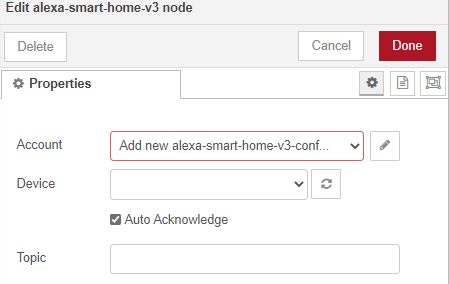

.. _rst_getting-started:
**********
Getting Started
**********
Before you can use this service with Alexa or Google Home you need to:

* Create and verify an `account. <https://red.cb-net.co.uk/new-user>`_
* Link your Amazon and/ or Google account with the Node-RED Smart Home Control skill
* Define one or more `devices. <https://red.cb-net.co.uk/devices>`_
* `Install Node-RED Nodes`_
* Setup Node-RED flows using your devices.

Account Linking
################

Link your Amazon Account
***************
.. tip:: There are Alexa restrictions based on region/ locale, Amazon publish and update their region-specific restrictions `here. <https://developer.amazon.com/it/docs/device-apis/list-of-interfaces.html>`_

To link your Amazon account:

1. Open Alexa App on your mobile device
2. Browse to "Skills and Games"
3. Search for "Node-RED Smart Home Control"
4. Link your account!

Link your Google Account
***************
.. warning:: You currently have to request extension of the skill to your Google account. Please contact `node-red@cb-net.co.uk <mailto:node-red@cb-net.co.uk>`_ for access.

To link your Google account:

1. Open the Google Home App
2. Hit Account icon (bottom right)
3. Under Account go to Settings
4. Under Settings go to Assistant
5. Under Assistant go to Home Control
6. Under Home Control open top-left menu and select "Manage account"

.. note:: Not all capabilities are supported by Google Home, the device creation wizard highlights which capabilities/ traits are supported. To remove the need to define Google or Alexa-specific devices the API itself will automatically only expose a devices' supported capabilities/ actions to Google Home. You can see a comparison between the two services here.

Install Node-RED Nodes
################
Install the Node-RED Nodes by either:

* Using the palette look for "node-red-contrib-alexa-smart-home"
* Using the command: `npm i node-red-contrib-alexa-smart-home`

Node-RED Configuration
################
Once Node-RED nodes are installed you'll need to configure your account settings, drag a new "alexa-smart-home-v3" node onto the canvas and double click it.

Click the edit button to define a new account:

Enter your Node-RED Smart Home Control username and password and click 'Add' to save the account details.

.. image:: account-config-details.png
    :alt: Screenshot of username/ password configuration.

You can now start to build flows using the concept and example flows in this documentation for inspiration.

.. tip:: Unless you are hosting your own instance of the skill, you can leave the default "MQTT Hostname" and "Web API Hostname" fields as-is.

.. warning:: You only need to define your account configuration once, re-use this configuration across all of your flow.

Concept Flows
################

Start Simple
***************
If you are planning to use voice control **only**, and you are not concerned about state visibility in the Alexa/ Google Home Apps, you only need:

* An "alexa-smart-home-v3" node (set to `Auto Acknowledge`_)
* A receiving node for commands, such as MQTT out/ publishing that enables you to interact with the device itself

.. image:: basic-flow.png
    :alt: Screenshot of basic concept flow example

.. note:: Any device you chose to use this simple flow with must be configured with "Report State" **disabled**. See `Add State`_ if you want to benefit from state information in your Smart Assistant application(s).

You may also require a standard Node-RED function node (with your own code) to "format" command output appropriately for your chosen endpoint - examples include HTTP request, MQTT out, Yamaha AVR nodes that will likely require a specific msg format.

This basic flow is a great starting point for first-time users. You can then progress to extend the flow to enable state updates, out-of-band state updates or to perform other functions as outlined in later examples.

.. warning:: You should only include a single "alexa-smart-home-v3" and single "alexa-smart-home-v3-state" node per device.

Add State
***************
.. tip:: Not all capabilities support state, see: `Capabilities that Support State <https://node-red-smart-home-control.readthedocs.io/en/development-cleanup/state-reporting.html#capabilities-that-support-state>`_

Now you have basic voice commands working, let's add state updates to your flow.

If you only plan on interacting with the device using the Alexa/ Google app, or voice assistants you can simply take state from the "alexa-smart-home-v3" node and feed it straight into the "alexa-smart-home-v3-state" node.

.. image:: basic-flow-state.png
    :alt: Screenshot of concept flow with basic state updates

If, however, you will physically interact with the device, or it has a timer function or there are any other means for you to change its state, you will need to ensure you are sending "out of band" state updates (where the changes in state have not come from activity within the service itself) to the Node-RED Smart Home Control service.

.. image:: concept-oob-state.PNG
    :alt: Screenshot of concept flow with out-of-band state updates

In the example above you can see a function node that has been created to intercept MQTT messages for the device and "translate" them to the required format to send back to Node-RED Smart Home Control. Example function code, for a wi-fi light switch running Tasmota firmware is shown below::

    var tokens = msg.topic.split("/");
    var device = tokens[1];
    var element = tokens[2]
    var state = msg.payload;

    // MQTT POWER State
    if (element == 'POWER') {
        return { "payload" : { "state" : { "power" : state } }, "acknowledge" : true };
    }

.. warning:: When both an "alexa-smart-home-v3" and "alexa-smart-home-v3-state" node are used in a flow you must ensure that these nodes are configured for the same device.

Auto Acknowledge
***************
By default, when you add an "alexa-smart-home-v3" node to a flow it is configured for "Auto Acknowledge," this means that a response is sent back to Node-RED Smart Home Control confirming that the command has been received, and it is **assumed** that the command was successful. This may not be desirable, depending upon the criticality of the command you have issued.

It is possible to disable "Auto Acknowledge" and use your own logic to establish whether the command was successful, before setting `msg.acknowledge` to `true` or `false` and sending the message to a `alexa-smart-home-v3-resp` node. Note that you must send the **original** message, as output from the "alexa-smart-home-v3" node, modified to include msg.acknowledge.

.. image:: concept-response.png
    :alt: Screenshot of concept flow with response node

.. warning:: This is the most advanced flow type, the majority of scenarios do not warrant/ require this level of complexity - it's just available should you want it!