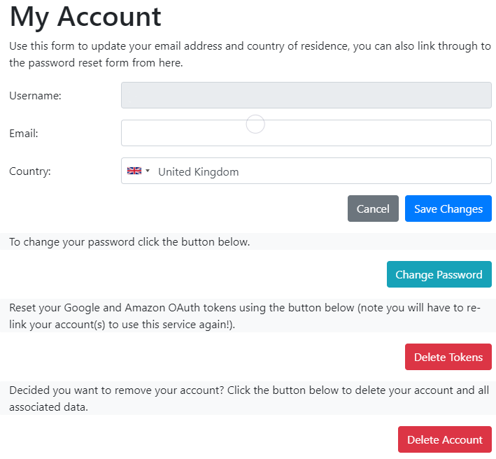

**********
Troubleshooting
**********
When something isn't working as expected you have a few things you can check.

Add a Node-RED Debug Node
################
Add a debug node after any "alexa-smart-home-v3" node, you can then verify that the command output is being received when you issue a voice command, or interact with a device using the Alexa/ Google Home applications. Ensure you configure the debug node to "output complete msg object."

.. image:: debug.png
    :alt: Screenshot of debug node, linked to Node-RED Smart Home Control flow

Review the Node-RED Debug Console
################
You should keep an eye on the built-in debug console, available in the Node-RED web-interface. The skill will send messages to your individual Node-RED instance if you send an incorrect state update/ an update that is in the wrong format. You will also be warned if your account is subject to `Throttling?`_

.. image:: warning.png
    :alt: Screenshot of warning message in Node-RED debug console

Check MQTT Messages
################
If you're not seeing any errors in the Node-RED debug console you can use "mosquitto_sub" to check your account-specific MQTT messages. This will enable you to confirm that the Node-RED Smart Home Control API is receiving your commands, at that they are available to your Node-RED Instance::

    mosquitto_sub -h mq-red.cb-net.co.uk -t '#' -v -u <bridge_username> -P '<bridge password>' --capath /etc/ssl/certs --id test-<bridge_username> -p 8883

If, after issuing voice or Alexa/ Google Home application based commands, you see no output you should:

* Reset your password via the `My Account <https://red.cb-net.co.uk/my-account>`_ page - it may be your Web API and MQTT account passwords are no longer synchronised.

.. note:: You'll only see messages for your account, the service uses Access Control Lists (ACLs) to filter MQTT messages.

Review Node-RED Console Log
################
A final, and more "involved" approach, is to look at the Node-RED console logs. The skill related Nodes/ contrib output significant information to the console log. Include any output here, and from the commands/ views above if you end up raising an issue on GuitHub.

For Docker-deployed instances, this is as simple as executing the command (container name dependant)::

    sudo docker logs -f nodered

Throttling?
################
Yes, throttling. Due to the architecture of Alexa skills, there is an AWS Lambda function that supports this service/ any Amazon interactions. In order to limit potential costs and ensure a good service experience for users across Node-RED Smart Home Control, a rate limiter is in-place for:

* Viewing state in the Alexa Application

In day-to-day usage you are extremely unlikely to be throttled, however during testing you may trigger the rate limit against your account/ a specific device.

.. note:: The current rate limit is 100 requests, per device, per hour. If you exceed the defined limit you will be unable to request state data on the specific device for one hour. Commands are currently unaffected by this limit. This is subject to change at any time, without warning.

Re-link Your Account
################
The equivalent of turning it off an on again... I know! It is definitely worth un-linking/ disabling the skill via your smart assistant application and re-linking/ enabling the skill.

Before doing this it is worth clearing your account "tokens", the "Delete Token" button found on the "My Account" page:

Then use your smart assistant/ smart home app to disable the skill and re-enable it (which should trigger the account linking workflow).

Some users of the service have been linked with a ***development-only** edition of the skill which can expire after 90 days of development inactivity. Since the majority of development work occurs in the API/ back-end it is highly likely that this can be a re-occurring issue.

The production version of the skill is a "permanent" fixture.

Still Stuck?
################
Check out the `GitHub repository <https://github.com/coldfire84/node-red-alexa-home-skill-v3-web>`_ for this project where you can raise questions, bugs and feature requests.

There is also a new `Slack channel <https://join.slack.com/t/cb-net/shared_invite/enQtODc1ODgzNzkxNTM3LTYwZGZmNjAxZWZmYTU4ZDllOGM3OTMxMzI4NzRlZmUzZmQ4NDljZWZiOTIwNTYzYjJmZjVlYzhhYWFiNThlMDA>`_  where you can engage in the discussion.

.. warning:: Node-RED Smart Home Control is an open source, free to use service. There is no warranty or support, implied or otherwise and the creators and contributors of this service and/ or related website are not responsible for any issues arising from it's use, including loss or damage relating to equipment, property, injury or life. You consume this service at your own risk.